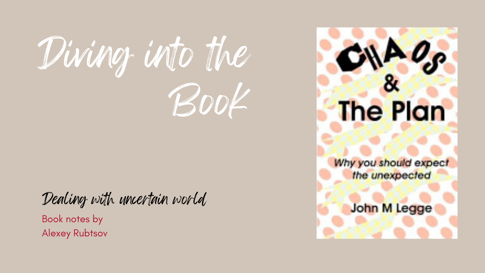

I had such a great time reading the book! It really got my mind buzzing with all sorts of interesting thoughts and ideas. I totally agree that we live in a world where dealing with chaos is just a part of life. But you know what? It's important to approach chaos with respect and recognize how it affects us. That way, we can do our best to handle all the twists and turns it throws our way. And hey, in the midst of all that chaos, we can still find ways to grow and find harmony in our crazy world.
## My notes
There will always be someone who works worse and is not as smart, but they will earn more because they were lucky. Luck itself exists, although factors that can be influenced should not be taken for luck.

The leader always takes risks. Someone has to jump into the water first. If the leader is strong and lucky, they may even return home with a catch.

Fear is a strong, perhaps even the strongest emotion. And modern people rarely fear anything more than appearing funny or stupid. This needs to be taken into account in oneself, and especially in others.

Economics and decisions made by economists with higher education do not create any predictable environment at all. Actors take a multitude of actions that, through a cumulative effect, can produce completely unpredictable results, both positive and negative.
## Main outcomes
1. **The world is inherently uncertain.** No matter how much planning and forecasting we do, there will always be unexpected events that can throw our plans off course. This is because the world is a complex system, and small changes in one part of the system can have big consequences in another part.
2. **We need to be flexible and adaptable in order to cope with uncertainty.** We can't control the unexpected, but we can control how we respond to it. If we're flexible and adaptable, we'll be better able to recover from setbacks and keep moving forward.
3. **We need to build resilience into our systems.** Resilience is the ability to bounce back from shocks and stresses. We can build resilience into our systems by diversifying our resources, having contingency plans in place, and creating a culture of learning and adaptation.

In addition to these three main outcomes, the book also provides a number of practical tips for dealing with uncertainty. These tips include:

- Set realistic expectations.
- Don't be afraid to change your plans.
- Build relationships with people who can help you when things go wrong.
- Be prepared to learn from your mistakes.
- Celebrate your successes, even small ones.
## Possible actions
Living in the chaos can be scary, but at the same time, the book gives us some guidance and hope. What if we could use chaos for our own benefit, or at least to live with its company and be happy?

**Goal:** To become more resilient and adaptable in the face of uncertainty.

**Action 1:** Set realistic expectations. Don't expect everything to go your way. Instead, expect the unexpected and be prepared to adapt.

- Start by identifying the areas of your life where you tend to have unrealistic expectations. For example, maybe you expect to get a promotion every year at work, or maybe you expect to always be happy and content.
- Once you've identified these areas, start to challenge your thinking. Ask yourself if your expectations are really realistic. Are there any factors that you're not considering?
- Once you've challenged your thinking, start to set more realistic expectations. For example, maybe you can expect to get a promotion every two years, or maybe you can expect to be happy and content most of the time, but not all the time.

**Action 2:** Don't be afraid to change your plans. If things don't go according to plan, don't be afraid to change your plans. In fact, you should expect to have to change your plans several times.

- Start by identifying your current goals and plans. What are you working towards? What are your steps for achieving your goals?
- Once you've identified your goals and plans, start to think about what could go wrong. What are some unexpected events that could happen that could derail your plans?
- Once you've identified some potential unexpected events, start to think about how you would respond to them. How would you change your plans?

**Action 3:** Build relationships with people who can help you when things go wrong. Having a strong network of supportive people can make a big difference when you're facing uncertainty.

- Start by identifying the people in your life who are supportive and helpful. Who are the people you can go to when you need help or advice?
- Once you've identified these people, make sure to nurture your relationships with them. Spend time with them, let them know how much you appreciate them, and ask for their help when you need it.

**Action 4:** Be prepared to learn from your mistakes. Everyone makes mistakes. The important thing is to learn from them and move on.

- Start by identifying the mistakes you've made in the past. What were the mistakes? What did you learn from them?
- Once you've identified your mistakes, start to think about how you can avoid making them in the future. What can you do differently next time?
- Finally, be kind to yourself when you make mistakes. Everyone makes mistakes, and it's important to learn from them and move on.

**Action 5:** Celebrate your successes, even small ones. It's important to take the time to celebrate your successes, no matter how small they may seem. This will help you stay motivated and keep moving forward.

- Start by identifying your successes, both big and small. What have you accomplished recently? What are you proud of?
- Once you've identified your successes, take some time to celebrate them. Tell your friends and family about them, and give yourself a pat on the back.
## Conclusion
The book emphasises the importance of approaching chaos with respect and recognising how it affects us. The author suggests setting realistic expectations, being open to changing plans, building relationships with supportive people, learning from mistakes, and celebrating successes. I, after the author, encourage resilience and adaptability in the face of uncertainty.
