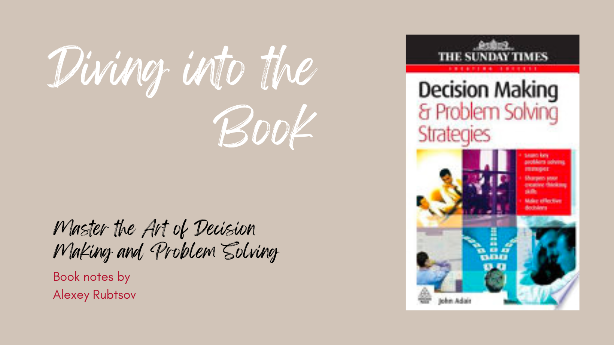

Decision making and problem solving strategies is a book written by J.E. Adair in 2010. It provides practical guidance and strategies for making effective decisions and solving problems. The book covers various decision-making models, problem-solving techniques, and tools that can be applied in different situations. It emphasizes the importance of critical thinking, creativity, and collaboration in the decision-making process. Overall, the book is a valuable resource for individuals and organizations seeking to improve their decision-making and problem-solving skills. [1]

So, dear readers, if you are ready to unlock the secrets of effective decision making and problem-solving, "Decision Making and Problem Solving Strategies" by J.E. Adair is the book for you. Prepare to be captivated, enlightened, and transformed as you embark on this thrilling journey of discovery.

Decisions are easy right?

It takes just five steps:

	•	Define the objective

	•	Collect relevant information

	•	Generate feasible options

	•	Make the decision

	•	Implement and evaluate

Then why is it so hard to make a decision now and then? Shall we read about it, maybe?

## Overview

Adair's writing style is as captivating. He effortlessly combines expert analysis with real-life examples, making the concepts accessible and relatable. Each page is filled with a sense of urgency, as if we are on the edge of our seats, waiting to uncover the next clue.

Chapter 1. Introduction
This chapter provides an overview of the book and introduces the concepts of decision making and problem solving strategies.

Chapter 2. Understanding Decision Making
This chapter explores the process of decision making and discusses various models and theories related to decision making.

In this chapter, Adair explores the fundamental concepts and principles that underpin effective decision making.

The crux of Chapter 2 lies in comprehending the decision-making process and the myriad factors that exert their influence on it. Adair underscores the paramountcy of collecting pertinent information, objectively analyzing it, and contemplating diverse alternatives prior to arriving at a decision. He accentuates the significance of critical thinking and problem-solving prowess in this intricate process.

Moreover, the chapter explores the notion of rational decision making, wherein choices are made by employing logical reasoning and evidence. Adair examines the advantages of utilizing rational decision-making models, such as the rational-economic model and the administrative model, to steer decision-making procedures.

Furthermore, Adair underscores the significance of intuition in the process of decision making. He elucidates that intuition can serve as a precious instrument when employed alongside rational analysis. By amalgamating logical reasoning with intuitive perceptions, decision makers can augment their proficiency in making judicious and expedient decisions.

Chapter 3. Problem Solving Techniques
This chapter presents different problem solving techniques and provides practical examples to illustrate their application.

In this chapter, Adair explores the various aspects and processes involved in making effective decisions.

The crux of Chapter 3 revolves around comprehending the pivotal components of decision making. Adair underscores the significance of collecting pertinent information and conducting a comprehensive analysis prior to arriving at a decision. He accentuates the importance of taking into account both quantitative and qualitative factors, along with the potential risks and uncertainties linked to each decision.

Moreover, Adair compellingly explores the pivotal role of intuition and creativity in the process of decision making. He convincingly argues that while rational analysis is undeniably significant, it is equally imperative to have faith in one's instincts and embrace unconventional thinking. Adair offers a plethora of practical techniques and strategies to amplify creative thinking and enhance problem-solving abilities.

Chapter 4. Decision Making in Groups
This chapter focuses on decision making in group settings and discusses the challenges and strategies for effective group decision making.

In order to make effective decisions and solve problems, it is crucial to have a variety of creative ideas to choose from. The chapter emphasizes the need to break away from conventional thinking and encourages readers to explore different perspectives and possibilities.

Chapter 4 of J.E. Adair's renowned book, "Decision Making and Problem Solving Strategies," takes us on a thrilling journey of discovery. Like a master detective, Adair skillfully unravels the secrets behind effective decision making, leaving readers spellbound and eager to apply these strategies in their own lives.

The author highlights several techniques and strategies to stimulate creativity, such as brainstorming, mind mapping, and lateral thinking. These methods help individuals to generate a wide range of ideas and consider alternative approaches to problem-solving.

With a flair for storytelling, Adair introduces us to a cast of characters who find themselves facing complex dilemmas. Through their experiences, we gain valuable insights into the decision-making process and the strategies that can lead to successful outcomes.

Furthermore, the chapter emphasizes the importance of creating an environment that fosters creativity. This includes encouraging open communication, promoting a positive and non-judgmental atmosphere, and providing opportunities for collaboration and idea sharing.

Chapter 4 delves into the art of problem-solving, revealing the intricate steps required to navigate through challenges. Adair presents a comprehensive framework that guides readers through the decision-making process, from defining the problem to evaluating potential solutions. With each turn of the page, we become more engrossed in the narrative, eager to uncover the strategies that will lead us to victory.

Chapter 5. Ethical Decision Making
This chapter explores the ethical considerations in decision making and provides guidelines for making ethical decisions.

In this chapter, Adair explores different approaches individuals take when making decisions. He highlights four main decision-making styles: rational, intuitive, dependent, and avoidant. 

The rational style emphasizes logical analysis, systematic thinking, and gathering as much information as possible before making a decision. This style is often used in complex and high-stakes situations.

The intuitive style, on the other hand, relies on gut feelings, instincts, and personal experiences. Intuitive decision-makers tend to trust their intuition and make quick judgments based on their past knowledge and expertise.

The dependent style involves seeking guidance and advice from others before making a decision. Individuals with this style may lack confidence in their own judgment and rely heavily on the opinions and expertise of others.

Lastly, the avoidant style is characterized by procrastination and reluctance to make decisions. Avoidant decision-makers may fear making the wrong choice or facing potential consequences, leading to delays and indecisiveness.

Adair emphasizes that understanding one's decision-making style can help individuals become more self-aware and improve their decision-making process. By recognizing their strengths and weaknesses, individuals can adapt their approach to different situations and make more effective decisions.

## Rational vs Intuitive

### Rational

Rational decision making refers to the process of making choices that are logical, objective, and based on careful analysis of available information.

According to Adair, rational decision making involves several key steps. The first step is to clearly define the problem or decision that needs to be made. This involves identifying the desired outcome and understanding the underlying factors that contribute to the problem.

Once the problem has been defined, the subsequent step involves gathering pertinent information. This encompasses the collection of data, conducting thorough research, and seeking input from diverse sources. Adair underscores the significance of acquiring precise and dependable information to guarantee well-informed decision-making.

After gathering information, the next step is to analyze and evaluate the available options. Adair suggests using techniques such as cost-benefit analysis, SWOT analysis, and decision trees to assess the potential outcomes and risks associated with each option. This analytical process helps in identifying the most viable and effective solution.

Once the options have been evaluated, the decision maker needs to make a choice. Adair emphasizes the importance of considering both the short-term and long-term consequences of the decision, as well as the potential impact on stakeholders. The decision should align with the overall goals and values of the individual or organization.

Adair emphasizes the crucial role of implementing and evaluating the decision, underscoring its significance. This entails putting the selected solution into practice and closely monitoring its efficacy. If needed, modifications can be introduced to guarantee the attainment of the desired results.

### Intuitive

Intuitive decision making refers to the process of making decisions based on instinct, gut feelings, or hunches, rather than relying solely on logical analysis or extensive data.

In the book, Adair highlights that intuitive decision making can be a valuable approach in certain situations. It can be particularly useful when faced with complex or ambiguous problems where there is limited time or information available. Intuition allows individuals to tap into their subconscious knowledge and experiences, enabling them to quickly assess a situation and make a decision without going through a lengthy analytical process.

Adair also emphasizes that intuitive decision making is not purely based on guesswork or random thoughts. It is often the result of years of experience, expertise, and pattern recognition. Through repeated exposure to similar situations, individuals develop a "gut feeling" or intuition that guides their decision-making process.

However, it is crucial to acknowledge that intuitive decision making is far from infallible. Adair strongly warns against placing complete trust in intuition, as it can introduce biases, mistakes, and illogical choices. Consequently, it becomes imperative to strike a balance between intuition and critical thinking, incorporating analytical approaches into the decision-making process. Adair proposes that a synergistic blend of both intuitive and analytical methods can yield superior outcomes.

In the book 'Decision Making and Problem Solving Strategies' by J.E. Adair, intuitive decision making is highlighted as a valuable strategy. This approach involves relying on instinct, gut feelings, and past experiences to make decisions. Although it can be beneficial in specific circumstances, it is crucial to strike a balance between intuition and critical thinking to achieve more precise and rational decision making.

## Conclusion

Adair's book is not just a mere guide; it is a captivating tale that keeps readers engaged from start to finish. The author's ability to blend theory with practical examples ensures that readers can apply these strategies in their own lives, transforming them into decision-making virtuosos.

I can recommend it to anyone who can look at decision making process armed with a bit of theoretical knowledge and old good common sense.

# References

1 - Adair, J.E. (2010). Decision making and problem solving strategies. Kogan Page.