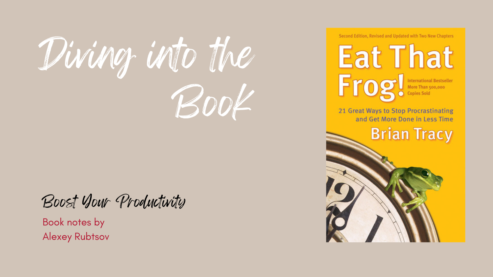

When I first came across the book's title, I was immediately drawn to it. After a few months, I finally had the chance to read the book, and I must say, it definitely lived up to my expectations.

I've got a super short summary for you! After reading the book, I can say that this is the essence of it. However, I highly recommend reading the book yourself if you haven't already.

## Ultra short summary

### 1. Eat the frog!

Productivity is a habit
	•	multi-tasking is my enemy
Achievement is not thinking, planning or meeting
	•	achievement is result of doing
Preparation is a key
	•	law of 3: 3 things you do before everything else
	•	everything you need for particular task should be prepared
	•	plan for day - means priority with 80/20 rule
	•	blocking the time and selecting the task that fits available block helps
	•	technology can decrease Productivity use it wisely. Avoid bells-n-whistles and distraction
	•	split the task so it contains directly actionable directive

## The main points of the book "Eat That Frog"

1. The concept of "eating the frog": The author emphasizes the importance of tackling your most challenging and important tasks first thing in the morning, which he refers to as "eating the frog." By doing so, you can overcome procrastination and increase your productivity.

2. Setting clear goals: Tracy emphasizes the significance of setting clear, specific, and measurable goals. He provides practical techniques for setting goals and breaking them down into smaller, manageable tasks.

3. Prioritization and time management: The book emphasizes the importance of prioritizing tasks based on their importance and urgency. Tracy introduces various techniques, such as the 80/20 rule and the ABCDE method, to help readers prioritize effectively and manage their time efficiently.

4. Overcoming procrastination: Tracy provides strategies for overcoming procrastination, such as identifying the reasons behind it, breaking tasks into smaller steps, and using positive reinforcement to motivate yourself.

5. Focus and concentration: The author emphasizes the importance of maintaining focus and concentration on the task at hand. He provides techniques for eliminating distractions, managing interruptions, and improving concentration.

6. Developing good habits: Tracy emphasizes the importance of developing good habits that support productivity and success. He provides practical tips for developing habits such as planning, organizing, and reviewing your progress regularly.

## The main concept

>The most valuable tasks you can do each day are often the hardest and most complex. But the payoff and rewards for completing these tasks efficiently can be tremendous. [1]

In the book "Eat That Frog" by Brian Tracy, the concept of "eating the frog" refers to tackling your most challenging and important task first thing in the morning. The idea behind this concept is that if you start your day by completing the most difficult task, everything else will seem easier in comparison.

Tracy uses the metaphor of a frog to represent the task that you are most likely to procrastinate on or avoid altogether. Just like the thought of eating a live frog, the idea of tackling a difficult task can be daunting and unappealing. However, by facing it head-on and completing it early in the day, you can gain a sense of accomplishment and momentum that will carry you through the rest of your tasks.

The concept of "eating the frog" is based on the principle of prioritization and time management. By identifying your most important task and giving it your full attention, you can increase your productivity and effectiveness. Tracy emphasizes the importance of focusing on high-value activities that align with your goals and contribute to your long-term success.

By adopting the habit of "eating the frog," you can overcome procrastination and develop a proactive mindset. This approach helps you to avoid wasting time on less important tasks or getting caught up in busywork. Instead, you can make significant progress towards your goals and achieve greater results.

In summary, the concept of "eating the frog" in the book "Eat That Frog" encourages you to tackle your most challenging task first thing in the morning. By doing so, you can increase your productivity, overcome procrastination, and achieve greater success in your personal and professional life.

## Setting clear goals

>Your ability to set clear, written goals, and then to work toward them every day, will do more to guarantee your success than any other single factor. [1]

In the book 'Eat That Frog' by Brian Tracy, he emphasizes the importance of setting clear goals in order to achieve success and overcome procrastination. Tracy suggests that by clearly defining your goals, you can create a roadmap for your actions and increase your motivation to take the necessary steps towards achieving them.

Setting clear goals involves a few important elements. First and foremost, it's crucial to be specific about what you want to achieve. Having vague or general goals can cause confusion and a lack of direction. By clearly defining your goals, you can concentrate your efforts and make them more achievable.

Secondly, Tracy emphasizes the importance of setting measurable goals. This means that your goals should be quantifiable, allowing you to track your progress and determine whether you are on the right track. Measurable goals provide a sense of accomplishment as you reach milestones along the way.

Additionally, setting realistic goals is crucial. While it is important to challenge yourself, setting goals that are too ambitious or unattainable can lead to frustration and demotivation. Tracy suggests breaking down larger goals into smaller, more manageable tasks, making them easier to achieve and maintain momentum.

In addition, it is important to set goals with specific timeframes. By giving your goals deadlines, you create a sense of urgency and avoid putting things off. Time-bound goals also assist in prioritizing tasks and managing your time and resources efficiently.

In "Eat That Frog," Tracy emphasizes the importance of writing down your goals. By putting your goals on paper, you make them tangible and increase your commitment to achieving them. Writing down your goals also allows you to review and revise them as needed, ensuring they remain relevant and aligned with your overall objectives.

## Overcoming procrastination

The author shares some really helpful insights and strategies on how to overcome procrastination. Procrastination is something that a lot of people struggle with, but Tracy provides practical advice that can really make a difference.

>The law of forced efficiency says that there is never enough time to do everything, but there is always enough time to do the most important thing. [1]

Tracy emphasizes the importance of prioritization. He suggests that we should identify our most important tasks, or 'frogs,' and tackle them first thing in the morning. This helps us avoid procrastination and stay focused on completing important tasks promptly.

Tracy also highlights the significance of setting clear goals and creating a roadmap for achieving them. By breaking down larger tasks into smaller, more manageable steps, we can make progress and avoid feeling overwhelmed. This approach helps to build momentum and motivation, making it easier to overcome procrastination.

Another strategy Tracy suggests is the use of time management techniques, such as the Pomodoro Technique. This technique involves working in focused bursts of time, typically 25 minutes, followed by a short break. By working in short, concentrated intervals, we can increase productivity and reduce the likelihood of getting distracted or procrastinating.

Tracy also highlights the significance of self-discipline and building positive habits. He motivates readers to adopt a mindset of taking prompt action and resisting the urge to postpone tasks. Through consistent practice of self-discipline and the formation of productive habits, we can conquer procrastination and accomplish our goals more efficiently.

## Conclusion

>The key to success is to focus our conscious mind on things we desire, not things we fear. [1]

A great tip is to start your day by tackling your most important and challenging tasks. This concept, known as 'eating the frog,' involves completing your most difficult task early on. By doing so, you can overcome procrastination and increase your productivity for the rest of the day. Prioritizing and focusing on tasks that have the greatest impact on your goals will help you avoid feeling overwhelmed and make significant progress towards achieving success.

The book highlights the significance of effective time management in achieving success and overcoming procrastination. It emphasizes the importance of prioritizing tasks, starting with the most challenging ones (referred to as the metaphorical 'frog'), and staying focused by avoiding distractions. Tracy offers practical strategies and techniques to help readers cultivate discipline, concentration, and productivity in their everyday lives. By applying the principles outlined in the book, individuals can conquer procrastination, enhance productivity, and ultimately accomplish their goals.

# References

1 - Tracy, B. (2007). Eat That Frog. Berrett Koehler Publishers, Inc., San Francisco.

