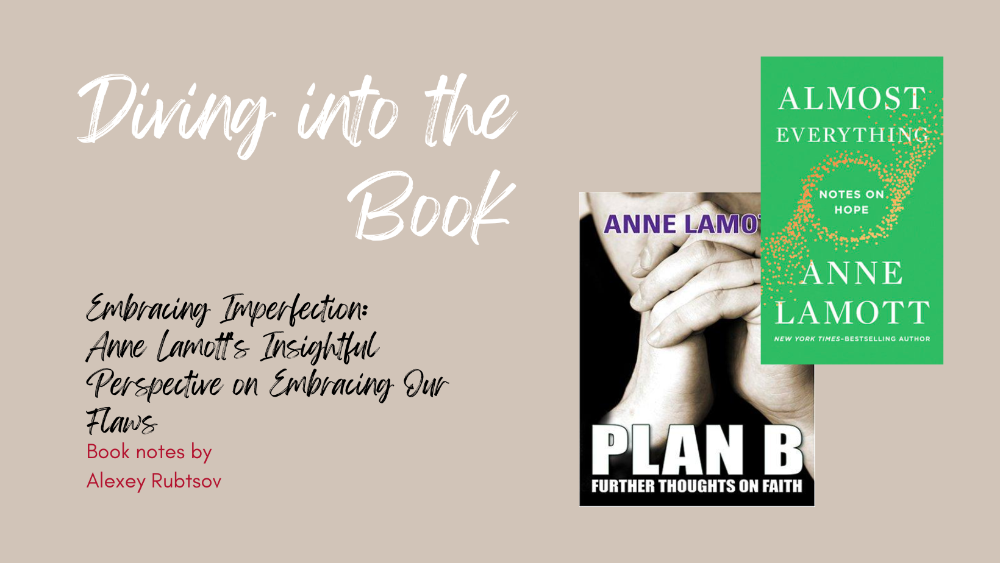

Author Anne Lamott on imperfection:
“Almost everyone is screwed up, broken, clingy, scared, and yet designed for joy. Even (or especially) people who seem to have it more or less together are more like the rest of us than you would believe. I try not to compare my insides to their outsides, because this makes me much worse than I already am, and if I get to know them, they turn out to have plenty of irritability and shadow of their own. Besides, those few people who aren’t a mess are probably good for about twenty minutes of dinner conversation.
This is good news, that almost everyone is petty, narcissistic, secretly insecure, and in it for themselves, because a few of the funny ones may actually long to be friends with you and me. They can be real with us, the greatest relief. As we develop love, appreciation, and forgiveness for others over time, we may accidentally develop those things toward ourselves, too. [1]

There are two books by Anne Lamott that explore the theme of imperfection. It's a journey towards a perfect land, but we must remember that mastery requires our utmost effort. Imperfection, however, is a natural part of life.

Of course, the books are more than that, And the topic of imperfection is only one small bit, but today I wanted to highlight this one.

## The books

In 'Almost Everything', Anne Lamott explores the profound and mundane aspects of life, offering wisdom and guidance on how to navigate through the challenges and uncertainties. With her signature wit and honesty, Lamott reminds us that even in the face of adversity, there is always hope and the possibility for growth and transformatio [1]

Plan B is a book written by Anne Lamott in 2004. It is a collection of essays that explores Lamott's personal experiences and reflections on life, faith, and the challenges of living in a complex world. With her signature wit and honesty, Lamott shares stories of love, loss, and resilience, offering readers a glimpse into her own journey of finding hope and meaning in the midst of uncertainty. Plan B is a thought-provoking and inspiring read that reminds us of the power of embracing life's unexpected twists and turn [2]

## The outcomes

>Almost everything will work if you unplug it for a few minutes...including you. [1]

The author wants to highlight the fact that imperfection is something that is natural for all humans. It is important for us to embrace our flaws and acknowledge our mistakes as they play a crucial role in our personal development and overall happiness.

According to Lamott, embracing imperfection entails recognizing that life is untidy and capricious. She urges readers to release the pursuit of flawlessness and instead embrace the allure of imperfections. By doing so, we can nurture self-compassion and foster a more genuine and empathetic perception of ourselves and others.

Lamott also highlights the importance of embracing imperfection in our relationships. She suggests that accepting the flaws and imperfections of our loved ones can lead to deeper connections and more authentic relationships. By letting go of unrealistic expectations and embracing the imperfect nature of ourselves and others, we can foster greater understanding, empathy, and acceptance.

Moreover, Lamott underscores the importance of embracing imperfection, highlighting that it does not equate to accepting mediocrity or complacency. Rather, it involves acknowledging the unattainability of perfection and understanding that pursuing it can have negative effects on our overall well-being. Through embracing imperfection, we liberate ourselves from the relentless pursuit of flawlessness and redirect our attention towards personal development, gaining wisdom from our errors, and discovering happiness in the process.

The main outcomes from the book "Almost Everything" by Anne Lamott are:

1. Embracing Imperfection: Lamott emphasizes the importance of accepting our flaws and imperfections, and finding beauty in the messiness of life. She encourages readers to let go of the need for perfection and instead focus on self-compassion and self-acceptance.

2. Gratitude and Hope: The book highlights the significance of cultivating gratitude and finding hope even in the midst of difficult times. Lamott encourages readers to appreciate the small joys in life and to have faith that things will get better, even when it seems impossible.

3. Connection and Community: Lamott emphasizes the importance of human connection and the power of community. She encourages readers to reach out to others, to be vulnerable, and to support one another. She also emphasizes the importance of finding a sense of belonging and purpose in our relationships and communities.

4. Mindfulness and Presence: The book emphasizes the importance of being present in the moment and practicing mindfulness. Lamott encourages readers to slow down, pay attention to the world around them, and find joy in the simple things.

5. Embracing Change and Loss: Lamott acknowledges that life is full of change and loss, and she encourages readers to embrace these experiences as opportunities for growth and transformation. She offers insights and strategies for navigating through difficult times and finding meaning in the face of adversity.

>“Perfectionism is the voice of the oppressor, the enemy of the people. It will keep you cramped and insane your whole life, and it is the main obstacle between you and a shitty first draft. I think perfectionism is based on the obsessive belief that if you run carefully enough, hitting each stepping-stone just right, you won't have to die. The truth is that you will die anyway and that a lot of people who aren't even looking at their feet are going to do a whole lot better than you, and have a lot more fun while they're doing it.” [2]

Lamott explores the concept that life is untidy and imperfect, and encourages us to accept our flaws and imperfections.

One way this theme is evident is through Lamott's personal anecdotes and reflections. She shares her own struggles and insecurities, highlighting her imperfections and the mistakes she has made. Through her honest and vulnerable storytelling, Lamott encourages readers to accept their own imperfections and find beauty in the messiness of life.

In addition, Lamott places great emphasis on the significance of self-compassion and forgiveness. She acknowledges that every individual is prone to making mistakes and experiencing moments of vulnerability. However, Lamott believes that it is our response to these flaws that truly defines us. She urges readers to cultivate self-acceptance and to treat themselves with kindness, even in moments when they fail to meet their own expectations.

Furthermore, the theme of imperfection is also explored in the relationships depicted in the book. Lamott portrays flawed and complex characters who struggle with their own imperfections and make mistakes in their interactions with others. Through these relationships, Lamott highlights the messy and imperfect nature of human connections, emphasizing the importance of forgiveness, understanding, and acceptance.

>“Hope begins in the dark, the stubborn hope that if you just show up and try to do the right thing, the dawn will come. You wait and watch and work: you don't give up.” [2]

The main outcomes of the book 'Plan B' by Anne Lamott can be summarized as follows:

1. Embracing Imperfection: The book emphasizes the importance of accepting imperfections and embracing the messy aspects of life. Lamott encourages readers to let go of the need for perfection and instead focus on finding joy and meaning in the imperfect moments.

2. Finding Faith and Hope: Lamott explores the theme of faith and spirituality throughout the book. She shares her personal experiences and struggles, highlighting the power of faith in overcoming challenges and finding hope in difficult times.

3. Navigating Life's Challenges: "Plan B" delves into various challenges that individuals face, including loss, grief, addiction, and relationships. Lamott offers insights and advice on how to navigate these challenges, providing readers with practical tools and perspectives to cope with life's ups and downs.

4. Cultivating Resilience: The book emphasizes the importance of resilience and the ability to bounce back from setbacks. Lamott shares stories of resilience from her own life and encourages readers to develop resilience as a key trait for navigating life's uncertainties.

5. Embracing Community and Connection: Lamott emphasizes the significance of community and connection in finding support and strength. She highlights the importance of reaching out to others, building relationships, and finding solace in shared experiences.

Overall, "Plan B" offers a heartfelt and honest exploration of life's challenges and provides readers with insights, inspiration, and practical guidance on how to navigate these challenges with resilience, faith, and a sense of community.

# References

1 - Lamott, A. (2019). Almost Everything. Canongate Books.

2 - Lamott, A. (2004). Plan B. Thorndike Press.