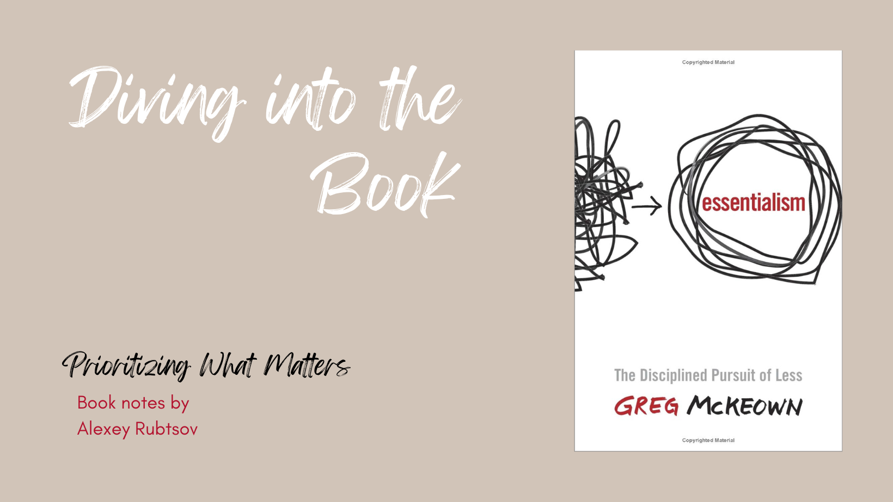

## Introduction
Our lives today are filled with endless clutter and nonstop demands on our time. How can we cut through the noise to focus on what's truly essential? That is the question at the heart of Greg McKeown's thought-provoking book Essentialism: The Disciplined Pursuit of Less. McKeown, a former Stanford lecturer and leadership consultant, makes a compelling case for paring down our pursuits to the vital few that really matter. With refreshing candour and clarity, he challenges the assumption that we can fit it all in and argues for purposeful choice in determining the essential.
## Summary of the plot
McKeown structures Essentialism around the fictional story of a Silicon Valley executive named Sam who struggles with being overworked yet underutilized. Sam tries to please everyone and has difficulty saying no, resulting in being stretched too thin across too many commitments. After being offered an early retirement package, Sam consults a mentor who advises him to operate as an “essentialist” - only doing the tasks he deems absolutely essential, and nothing else.

Emboldened by this advice, Sam starts to push back on non-essential requests and focus his efforts only on the most vital projects with the highest return. He eliminates busywork and unnecessary meetings, becoming more selective with how he spends his time. While Sam worries at first how this new approach will be received, he finds that his ruthless focus actually earns him more respect from colleagues. Sam gets his life back under control, enjoying more time with family and performing better at work.

McKeown weaves this story throughout Essentialism to illustrate the power of purposeful choice in determining the essential and cutting out the nonessential. Sam's journey models how to discern what really matters and execute on it in a disciplined fashion.
## Writing style
McKeown's writing is clear, succinct, and highly readable. He has a direct and conversational style that connects well with readers. McKeown avoids unnecessary jargon, communicating his ideas in a simple and straightforward manner.

The language McKeown uses is intended to be accessible to a broad audience. He employs engaging stories and real-world examples to illustrate key concepts. The narrative flows smoothly, and McKeown strikes a nice balance between big picture ideas and tactical advice.

The pacing is well done, with short, focused chapters that make the book easy to digest. McKeown effectively weaves together conceptual frameworks and practical tools. The use of the recurring fictional story about the Silicon Valley executive acts as a unifying narrative device.

Overall, McKeown's writing is effective in conveying the core message of focus and purposeful choice. The ideas are presented in a convincing yet nuanced way. McKeown's passion for the topic comes through clearly. The writing makes the case for Essentialism in an inspiring yet down-to-earth manner.
## The main topics
1. Prioritization: The book emphasizes the importance of identifying and focusing on what truly matters in our lives. It encourages readers to let go of non-essential tasks and commitments and instead prioritize the few things that are truly valuable and aligned with their goals and values.
2. Simplicity: Another theme is the idea of simplifying our lives. The author argues that by eliminating unnecessary distractions and clutter, we can create space for what is truly important and meaningful.
3. Essential Intent: The concept of essential intent is highlighted, which involves defining and pursuing a clear purpose or goal. By having a clear focus, readers are encouraged to make deliberate choices that align with their essential intent.
4. Saying No: The book emphasizes the importance of learning to say no to non-essential tasks and requests. By setting boundaries and being selective about where we invest our time and energy, we can create more space for what truly matters.
In terms of how well the author develops these themes, Greg McKeown does a commendable job. He provides practical strategies, real-life examples, and thought-provoking anecdotes to illustrate his points. The book is well-structured and offers a clear framework for readers to implement essentialism in their own lives.

The themes and messages in "Essentialism" resonate with many readers because they address common challenges in today's fast-paced and overloaded world. The book encourages readers to reevaluate their priorities, make intentional choices, and focus on what truly matters to them. By challenging the notion that more is always better, the author offers a refreshing perspective that resonates with those seeking a more meaningful and fulfilling life.
## Strengths and weaknesses
### Strengths:
1. Clear and Practical Framework: One of the book's strengths is its clear and practical framework for implementing essentialism. The author provides step-by-step guidance and actionable strategies that readers can apply to their own lives. This makes it easier for readers to understand and implement the concepts presented in the book.
2. Engaging Writing Style: Greg McKeown's writing style is engaging and easy to follow. He combines personal anecdotes, real-life examples, and research to make his points relatable and compelling. This helps to keep readers engaged throughout the book.
3. Thought-Provoking Insights: The book offers many thought-provoking insights about the importance of prioritization, simplification, and saying no to non-essential tasks. These insights challenge conventional wisdom and encourage readers to reevaluate their own habits and choices.
### Weaknesses:
1. Lack of Cultural Consideration: One weakness of the book is that it primarily reflects a Western perspective and may not fully consider cultural differences and contexts. Some of the strategies and examples provided may not be as applicable or relevant to readers from different cultural backgrounds.
2. Overemphasis on Individual Responsibility: While the book emphasizes personal responsibility and choice, it may not fully acknowledge external factors that can limit one's ability to pursue essentialism. For example, socioeconomic factors or external obligations may make it more challenging for some individuals to prioritize and simplify their lives.
3. Limited Exploration of Potential Trade-Offs: The book does not extensively explore the potential trade-offs and challenges that may arise from pursuing essentialism. While it advocates for focusing on what truly matters, it does not delve deeply into the potential consequences or sacrifices that may come with such choices.
## Conclusion 
"Essentialism: The Disciplined Pursuit of Less" by Greg McKeown is a compelling self-help book that offers valuable insights and practical strategies for living a more purposeful and fulfilling life. The book's strengths lie in its clear and practical framework, engaging writing style, and thought-provoking insights. It encourages readers to prioritize what truly matters, simplify their lives, and make intentional choices aligned with their essential intent.

While the book may have some weaknesses, such as a lack of cultural consideration and limited exploration of potential trade-offs, it still provides a valuable roadmap for those seeking to embrace essentialism.

I would recommend this book to individuals who feel overwhelmed by the demands and distractions of modern life and are seeking guidance on how to focus on what truly matters. It will resonate with those who are open to challenging conventional wisdom and are willing to make intentional changes in their lives. Whether you are a busy professional, a student, a parent, or simply someone looking for more meaning and fulfillment, "Essentialism" can provide valuable insights and practical strategies to help you simplify, prioritize, and live a more purposeful life.