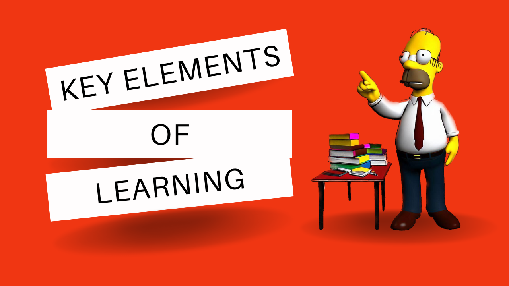

This time, I have decided to ask about learning. The matter is important for everyone, and the skill of learning is something we all need.

Also, I don't support the idea of studying books through shortened versions. Books deserve to be read. If you find after a couple of chapters that the book isn't for you, just skip it. I would advise starting with the book itself, not its summary.

I've done some research on the topic and started by asking one question.

# What are the key elements of good learning?

## In the book "The Art of Learning" by Josh Waitzkin, the author explores the key elements of good learning. According to Waitzkin, there are several important factors that contribute to effective learning:

1. Deep Focus: Waitzkin emphasizes the importance of developing deep focus and concentration. By immersing oneself fully in the learning process, distractions can be minimized, allowing for a more effective and efficient learning experience.

2. Mindfulness: Waitzkin encourages the practice of mindfulness, which involves being fully present and aware of one's thoughts, emotions, and actions. By cultivating mindfulness, learners can better understand their own learning process and make necessary adjustments to improve their performance.

3. Adaptability: Waitzkin emphasizes the need for adaptability in the learning process. He suggests that learners should be open to new ideas, approaches, and perspectives, and be willing to adapt their strategies as needed. This flexibility allows for growth and improvement over time.

4. Resilience: Waitzkin highlights the importance of resilience in the face of challenges and setbacks. He encourages learners to embrace failure as an opportunity for growth and to develop a mindset that sees obstacles as stepping stones to success.

5. Metacognition: Waitzkin emphasizes the value of metacognition, which involves thinking about one's own thinking. By reflecting on their learning process, learners can gain insights into their strengths and weaknesses, enabling them to make more informed decisions about their learning strategies. [1]

## According to the book "Mindset" by Carol S. Dweck, the key elements of good learning are as follows:

1. Embracing a growth mindset: Dweck emphasizes the importance of having a growth mindset, which is the belief that abilities and intelligence can be developed through dedication and hard work. This mindset encourages individuals to see challenges as opportunities for growth and to persist in the face of setbacks.

2. Emphasizing effort and process: Dweck highlights the significance of valuing effort and the process of learning over solely focusing on outcomes. By recognizing and praising the effort put into learning, individuals are more likely to develop a love for learning and a willingness to take on challenges.

3. Cultivating a love for learning: Dweck emphasizes the importance of fostering a love for learning. When individuals are intrinsically motivated and genuinely interested in the subject matter, they are more likely to engage in deep learning and retain information for the long term.

4. Embracing challenges: Dweck encourages individuals to embrace challenges as opportunities for growth. By stepping out of their comfort zones and taking on challenging tasks, individuals can develop new skills and expand their knowledge.

5. Emphasizing the power of yet: Dweck introduces the concept of "yet," which signifies that individuals may not have mastered a skill or concept yet, but with effort and perseverance, they can improve and achieve success in the future. This mindset shift helps individuals view setbacks and failures as temporary and motivates them to keep working towards their goals. [2]

## According to the book "Make It Stick" by Brown, Roediger, and McDaniel, there are several key elements of good learning. These elements are based on scientific research and have been proven to enhance learning and retention. Here are some of the key elements:

1. Retrieval Practice: Actively recalling information from memory is a powerful learning strategy. Regularly testing yourself on the material you are learning helps strengthen memory and improves long-term retention.

2. Spaced Practice: Distributing study sessions over time, with gaps in between, is more effective than cramming. Spacing out your learning allows for better consolidation of information and promotes long-term retention.

3. Interleaving: Mixing up different topics or types of problems during practice sessions helps to enhance learning. This approach challenges your brain to make connections and apply knowledge in different contexts, leading to deeper understanding and better retention. [3]

4. Elaboration: Going beyond simple repetition and actively seeking to explain and elaborate on the material being learned helps to solidify understanding. Connecting new information to existing knowledge and finding real-world applications can enhance learning and retention.

5. Concrete Examples: Using concrete examples and specific cases to illustrate abstract concepts helps to make learning more meaningful and memorable. Relating new information to familiar situations or experiences can aid in comprehension and retention.

6. Reflection: Taking time to reflect on what you have learned and how it connects to your prior knowledge and experiences can enhance understanding and retention. Reflective thinking promotes deeper processing of information and helps to solidify learning. [3]

## Conclusion

Summarizing the answers, I can list several points to consider for achieving the best results:

1. Deep focus, deliberate practice, and the ability to adapt and learn from mistakes are important for effective learning.

2. Having a growth mindset, where you believe that abilities can be developed through dedication and hard work, is crucial.

3. Active learning techniques, such as self-testing and spaced repetition, enhance long-term retention and understanding.

4. Various learning techniques, such as interleaving and varied practice, optimize learning and memory.

5. Providing clear learning goals, giving effective feedback, and fostering a positive learning environment are important.

6. Deep practice involves breaking down skills into small parts, repeating them, and focusing on areas that need improvement.

7. Being present and actively engaged in the learning process, questioning assumptions, and seeking multiple perspectives enhance learning.

8. Practical strategies for effective learning include using the Pomodoro Technique, creating a conducive learning environment, and utilizing different learning styles.

9. Adult learners have unique characteristics and needs, such as self-directed learning and incorporating real-life experiences into the learning process.

10. The learning sciences field offers research-based strategies for effective learning, collaborative learning, and the role of technology in learning.

Developing a comprehensive study plan requires additional time investment for each point mentioned. To help you better understand, I have compiled a list of recommended books below.

# References

1 - Waitzkin, J. (2008). The art of learning. Free Press.

2 - Dweck, C.S. (2006). Mindset. Ballantine Books.

3 - Brown, P.C., & Roediger, H.L., & McDaniel, M.A. (2014). Make It Stick. Dreamscape Media.

