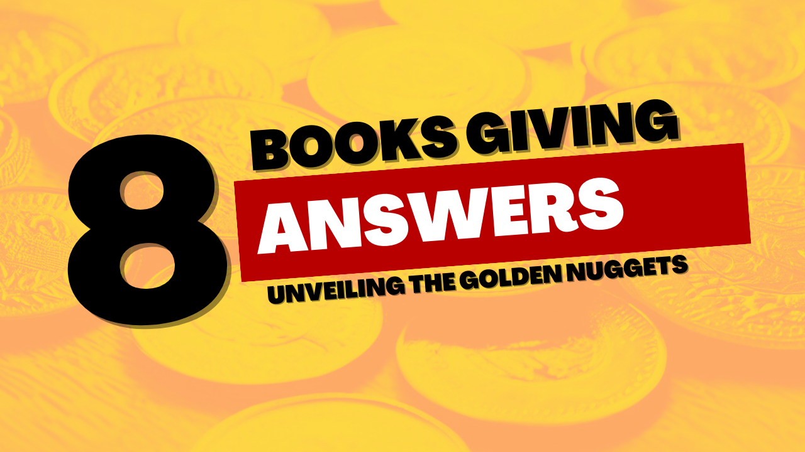

**Behavioral economics** is a field of study that combines elements of psychology and economics to understand how individuals make economic decisions. It recognizes that people **do not** always **act** in a perfectly **rational** or self-interested manner, but are influenced by cognitive biases, social norms, and emotions.

**Traditional economics** assumes that individuals **make decisions** based on maximizing their own **self-interest** and have perfect information and rationality. However, behavioral economics challenges these assumptions by incorporating insights from psychology to explain why people often deviate from rational decision-making.

Behavioral economics is a fascinating field that delves into the intricacies of human behavior. It explores interesting phenomena like loss aversion, where individuals are often more driven to avoid losses rather than acquire gains. Another intriguing concept it examines is the endowment effect, which reveals that people tend to value things they already possess more than identical things they don't possess. Additionally, behavioral economics sheds light on the concept of framing, demonstrating how the way information is presented can have a significant impact on decision-making.

Behavioral economics offers valuable insights into consumer behavior, financial markets, and public policy by studying how individuals make decisions. By understanding the factors that influence decision-making, it becomes possible to design interventions and policies that encourage individuals to make better choices, ultimately improving overall welfare.

Let's embark on a journey to discover the invaluable wisdom hidden within the pages of renowned books on behavioral economics.

## What is the main advice from the interesting and smart books that I truly enjoyed reading?

### Thinking, Fast and Slow

The main advice in the book 'Thinking Fast and Slow' by Daniel Kahneman is to embrace the power of self-awareness and recognize the two systems of thinking that shape our minds - the fast, intuitive System 1 and the slow, deliberate System 2. Kahneman highlights the significance of comprehending how these two systems function and how they can influence our thoughts with biases and errors. By acknowledging the limitations of our intuition and actively engaging our slower, more rational thinking processes, we can unlock our potential to make wiser decisions and steer clear of common cognitive pitfalls. [1]

### Nudge

The main advice in the book 'Nudge' by Richard H. Thaler and Cass R. Sunstein is to use the concept of 'nudging' to design choices and environments in a way that persuades people to make better decisions. The authors argue that by understanding human behavior and biases, policymakers and organizations can subtly influence people's choices without restricting their freedom of choice. The key idea is to make the desired option more attractive and accessible, while still allowing individuals to make their own decisions. This approach aims to improve outcomes in areas such as health, finance, and environmental sustainability. [2]

### Predictably Irrational

The main advice in the book "Predictably Irrational" by Dan Ariely is to recognize and understand the irrational behaviors that influence our decision-making processes. Ariely argues that humans are not always rational beings and are often influenced by biases, emotions, and social pressures. By becoming aware of these irrational tendencies, we can make more informed choices and avoid falling into predictable patterns of irrational behavior. [3]

### Misbehaving

The main advice in the book "Misbehaving" by Richard H. Thaler is to challenge traditional economic theories and embrace the concept of behavioral economics. Thaler argues that humans do not always act rationally and that our decisions are often influenced by biases and heuristics. He encourages readers to understand these biases and use them to their advantage, both in personal decision-making and in the design of public policies. Thaler's main advice is to recognize and embrace the fact that people are not always rational and to incorporate this understanding into our economic models and decision-making processes. [4]

### The Undoing Project

The main advice in the book "The Undoing Project" by Michael Lewis is to be aware of the biases and cognitive errors that can influence our decision-making processes. The book explores the groundbreaking work of psychologists Daniel Kahneman and Amos Tversky, who uncovered the systematic errors and biases that humans often fall victim to when making judgments and decisions. By understanding these biases, we can strive to make more rational and informed choices in our personal and professional lives. [5]

### Influence

The main advice in the book "Influence" by Robert Cialdini is to understand and utilize the principles of influence to effectively persuade others. Cialdini identifies six key principles of influence: reciprocity, scarcity, authority, consistency, liking, and consensus. By understanding and applying these principles, individuals can increase their ability to influence others and achieve their desired outcomes. [6]

### The Art of Thinking Clearly

The main advice in the book "The Art of Thinking Clearly" by Rolf Dobelli is to be aware of and avoid cognitive biases. The author emphasizes the importance of recognizing and overcoming the common errors in thinking that can lead to poor decision-making and flawed reasoning. By understanding these biases and learning how to think more clearly, readers can make better choices and improve their overall decision-making abilities. [7]

### Freakonomics

The main advice in the book "Freakonomics" by Steven D. Levitt is to think like an economist and approach problems with a different perspective. Levitt encourages readers to question conventional wisdom, challenge assumptions, and analyze data to uncover hidden patterns and incentives that drive human behavior. By applying economic principles to various aspects of life, Levitt aims to help readers understand the underlying forces that shape our world and make more informed decisions. [8]

# References

1 - Kahneman, D. (2012). Thinking Fast and Slow. Kimyoungsa/Tsai Fong Books.

2 - Thaler, R.H., & Sunstein, C.R. (2009). Nudge. Yale University Press.

3 - Ariely, D. (2010). Predictably irrational. HarperCollins Publishers Limited.

4 - Thaler, R.H., & Ganser, L. (2015). Misbehaving. Audible Studios on Brilliance Audio.

5 - Lewis, M. (2017). The undoing project. W. W. Norton & Company.

6 - Cialdini, R.B. (2006). Influence. Collins.

7 - Dobelli, R. (2014). The art of thinking clearly. Dobelli Rolf.

8 - Levitt, S.D. (2006). Freakonomics. HarperCollins Publishers.

