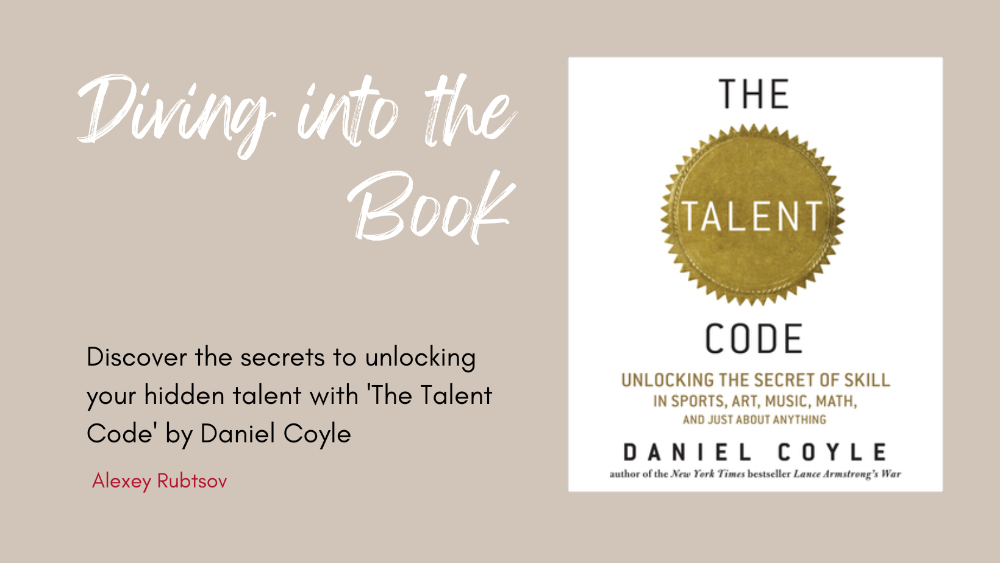

The Talent Code by Daniel Coyle is a book that explores the concept of talent and how it is developed. Coyle argues that talent is not innate, but rather a result of deep practice, ignition, and master coaching. He provides examples from various fields, including sports, music, and art, to support his theory. The book offers practical tips and strategies for individuals looking to unlock their full potential and develop their skills. [1]

## Book Overview

1. The book explores the concept of talent and argues that talent is not solely based on genetics or innate ability, but rather it is developed through a specific type of practice called "deep practice."

>“The best way to get a child to practice is to emphasize the value of practice itself, rather than the end result. In other words, it’s better to praise a child for the effort they put into practicing, rather than the outcome of their practice.” [1]

Deep practice is a highly effective learning technique that involves focused and repetitive practice. It challenges individuals to push themselves to the limits of their abilities. This method entails breaking down complex skills into smaller, manageable components and deliberately practicing them. The emphasis is on quality rather than quantity, ensuring that each practice session is purposeful and impactful. Deep practice demands intense concentration, active engagement, and a willingness to embrace mistakes as opportunities for growth and learning.

According to Coyle, deep practice is crucial for skill development as it triggers a process known as myelination. Myelin, a substance found in the brain, wraps around neural circuits and enhances the speed and precision of signals. By engaging in deep practice, the brain produces more myelin, thereby improving the efficiency and effectiveness of the neural pathways associated with a particular skill.

By emphasizing the importance of deep practice, Coyle challenges the notion that talent is solely determined by innate abilities. Instead, he suggests that talent is a result of deliberate and focused practice that allows individuals to continually improve and refine their skills.

2. Coyle introduces the concept of myelin, a substance in the brain that wraps around neural circuits and increases the speed and accuracy of signals. He explains that deep practice, which involves focused and repetitive practice, leads to the growth of myelin and ultimately enhances skill development.

>“The more a child is able to practice, the more myelin they lay down, and the better they get. It’s a simple equation: the more you practice, the better you get.” [1]

Coyle explains that deep practice, which involves focused and repetitive practice, leads to the growth of myelin. When we engage in deep practice, we are actively challenging ourselves and pushing beyond our comfort zones. This type of practice creates neural pathways in our brain, and with each repetition, the myelin around these pathways thickens, making the signals travel faster and more efficiently.

The growth of myelin through deep practice is crucial for skill development because it allows us to perform tasks with greater speed, accuracy, and precision. It helps us to automate certain actions and movements, making them more fluid and effortless.

Coyle emphasizes that myelin growth is not limited to physical skills like sports or playing a musical instrument. It also applies to cognitive skills such as problem-solving, critical thinking, and creativity. By engaging in deep practice and consistently challenging ourselves, we can enhance the growth of myelin in various areas of our brain, leading to improved performance and mastery of skills.

3. The book highlights the importance of ignition, which refers to the initial spark or motivation that drives individuals to pursue a particular skill or talent. Coyle emphasizes that finding and nurturing this ignition is crucial for talent development.

>“Ignition is about creating a hotbed of motivation. We can create an environment—whether it’s a school or a workplace or a bedroom—that maximizes the chances of ignition, by creating an ecosystem around the desired skill. This is where the talent hotbeds come in.” [1]

Coyle elaborates on the concept of ignition, highlighting that it can be sparked by diverse sources, including the influence of a role model, a significant personal experience, or an intense fascination with a specific activity. This pivotal moment occurs when individuals experience a powerful urge to immerse themselves in a particular skill or talent.

Once the ignition is present, it is crucial to establish an educational environment that fosters and motivates the cultivation of talent. This entails offering necessary resources, ample opportunities for practice, and a nurturing network of like-minded individuals who are driven by the same passion.

Coyle also emphasizes the role of mentors or coaches in nurturing and sustaining the ignition. These mentors can provide guidance, support, and feedback to help individuals develop their talent further.

4. Coyle explores the role of coaching in talent development and emphasizes the importance of coaches who provide specific and constructive feedback, create a supportive environment, and encourage deep practice.

>“The sweet spot: that productive, uncomfortable terrain located just beyond our current abilities, where our reach exceeds our grasp. Deep practice is not simply about struggling; it’s about seeking a particular struggle, which involves a cycle of distinct actions.” [1]

The author emphasizes several crucial aspects of coaching that greatly contribute to the development of talent. Firstly, it is highlighted that coaches play a vital role in providing specific and constructive feedback. This feedback is instrumental in helping individuals identify areas for improvement and make the necessary adjustments in their practice. By receiving targeted feedback, individuals can refine their skills and make progress more effectively.

Coyle highlights the importance of coaches in establishing a nurturing and encouraging setting. By cultivating a positive atmosphere, individuals are more likely to feel motivated and self-assured in their skills. This supportive environment also promotes trust between the coach and the individual, enabling open communication and a willingness to embrace challenges during practice.

Lastly, Coyle emphasizes the crucial role of coaches in promoting deep practice. Deep practice involves concentrated and repetitive training, where individuals push themselves beyond their comfort zone to continuously improve. Coaches play a vital role in guiding individuals through this process, providing them with guidance, structure, and motivation to help them achieve their utmost potential.

5. The book also discusses the concept of "chunking," which involves breaking down complex skills into smaller, manageable parts. Coyle explains that by focusing on these smaller chunks and mastering them individually, individuals can build a solid foundation for overall skill development.

The idea behind chunking is that by breaking down a complex skill into smaller components, it becomes easier to learn and master. This approach allows individuals to focus on specific aspects of the skill and gradually build their proficiency in each component. Once each chunk is mastered, they can then be combined to perform the skill as a whole.

Chunking is particularly effective because it helps to overcome the overwhelming nature of complex skills. By breaking them down into smaller parts, individuals can approach each chunk with more focus and attention, leading to more effective learning and improvement.

In "The Talent Code," Daniel Coyle provides examples of how chunking is applied in various fields, such as sports, music, and art. For example, in sports, athletes may break down a complex movement, such as a golf swing or a tennis serve, into smaller components and practice each component separately. Similarly, musicians may break down a complex piece of music into smaller sections and practice each section individually before putting them together.

By utilizing the concept of chunking, individuals can enhance their learning and skill development by focusing on specific components and gradually building their proficiency. This approach allows for more efficient and effective practice, ultimately leading to improved performance in the desired skill or domain.

6. "The Talent Code" provides numerous examples and case studies from various fields, such as sports, music, and art, to illustrate the principles of talent development and how they can be applied in different contexts.

>“The sweet spot: that productive, uncomfortable terrain located just beyond our current abilities, where our reach exceeds our grasp. Deep practice is not simply about struggling; it’s about seeking a particular struggle, which involves a cycle of distinct actions.” [1]

Daniel Coyle explores different domains such as sports, music, and art to showcase how talent is developed in each of these areas. He delves into the training methods and techniques used by successful individuals and teams to achieve high levels of performance.

For example, in the field of sports, Coyle examines the training methods of Brazilian soccer players and how their intense and focused practice sessions contribute to their exceptional skills on the field. He also looks at the training regimens of tennis players and how deliberate practice and feedback from coaches play a crucial role in their development.

In the realm of music, Coyle explores the practice routines of renowned musicians and how they break down complex pieces into smaller sections to master each component before putting it all together. He also discusses the importance of finding the right balance between repetition and variation in practice to enhance musical performance.

In the field of art, Coyle examines the training methods of painters and how they develop their artistic skills through deliberate practice and continuous experimentation. He emphasizes the importance of embracing failure and learning from mistakes as a means of improving artistic abilities.

Through these examples and case studies, Coyle demonstrates that the principles of talent development are applicable across different domains. By understanding the underlying processes and strategies used by successful individuals in various fields, readers can gain insights into how they can apply these principles to their own pursuit of talent and skill development.

# References

1 - Coyle, D. (2020). The talent code. Bantam.