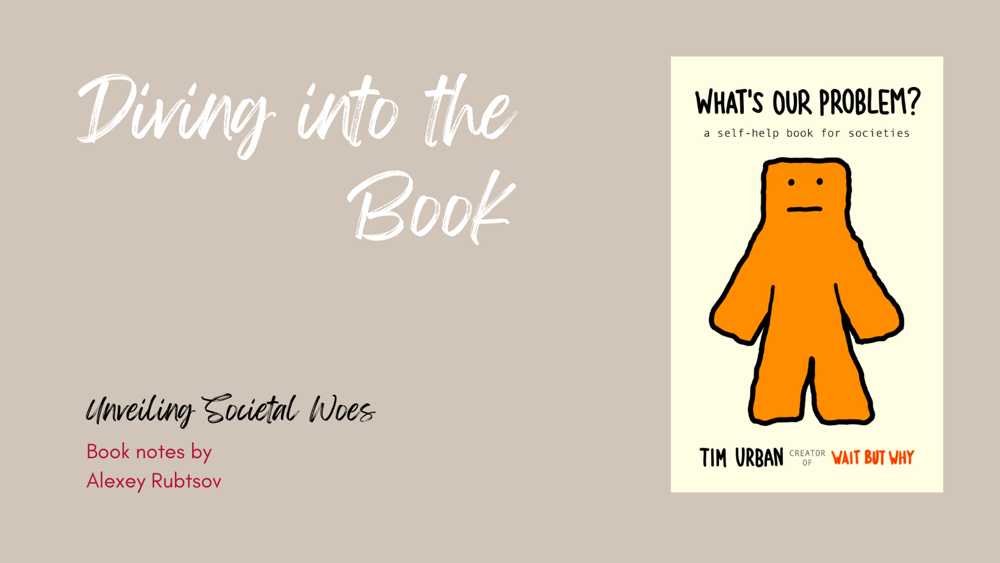

I've always been a huge fan of Tim's long-reads. He has this incredible ability to explain things like no one else. That's why I couldn't resist buying and reading his book. Actually, I pre-ordered it, eagerly waited, and then dove right into it.

>Tim Urban is the author of the book "What's Our Problem? A Self-Help Book for Societies." He is also the creator and co-founder of the popular blog Wait But Why, which features long-form articles on a wide range of topics, from artificial intelligence to procrastination to humans becoming a multi-planetary species.

Urban's work is known for its clear and engaging writing style, as well as its use of stick-figure illustrations to explain complex concepts. His TED talk on procrastination, which has been viewed over 10 million times, is a classic example of his unique approach to explaining complex ideas.

## Let me show you few examples of Tim’s posts:

### The Fermi Paradox

This post explores the mystery of why we haven't yet encountered any evidence of intelligent alien life. Urban presents 13 possible explanations for the Fermi Paradox, ranging from the mundane to the mind-bending.

https://blog.getpocket.com/2016/11/tim-urban-is-an-expert-on-not-being-an-expert/

### Procrastination

This post is a classic example of Urban's clear and engaging writing style. He uses stick-figure illustrations to explain the psychology of procrastination, and offers a number of tips on how to overcome it.

https://www.ted.com/talks/tim_urban_inside_the_mind_of_a_master_procrastinator

### The AI Revolution

This post explores the potential impact of artificial intelligence on our future. Urban argues that AI could be either our salvation or our destruction, and that it is up to us to decide which path we take.

https://boingboing.net/2015/01/23/the-road-to-superintelligen.html

### The Cook and the Chef

Musk's Secret Sauce. This post is a deep dive into Elon Musk's personality and work ethic. Urban argues that Musk is a "cook" rather than a "chef," and that his ability to think big and take risks is what has allowed him to achieve such great things.

https://www.goodreads.com/book/show/30339278-the-cook-and-the-chef

### How to Pick a Career (That Actually Fits You)

This post is a helpful guide for people who are struggling to find their dream career. Urban provides a step-by-step process for figuring out what you're good at, what you enjoy doing, and how to make a living doing it.

https://waitbutwhy.com/2018/04/picking-career.html

## And now - few words about the book itself

`I think the issues we face are not limited to just the USA, but are prevalent all over the world. It seems that those in power in many democracies are often not addressing the real problems.`

What's Our Problem? by Tim Urban is a book that explores the state of the modern world and argues that we need to change the way we think in order to solve the problems we face.
 [1]

The book begins by introducing the concept of the Primitive Mind and the Modern Mind. The Primitive Mind is the part of our brain that is responsible for our emotions, our instincts, and our sense of belonging. The Modern Mind is the part of our brain that is responsible for our logic, our reason, and our ability to think critically.

Urban argues that the Primitive Mind is often at odds with the Modern Mind. The Primitive Mind wants us to conform to our tribe, to believe what our tribe believes, and to see the world in black and white. The Modern Mind, on the other hand, wants us to be open-minded, to question everything, and to see the world in shades of gray.

Urban argues that the rise of tribalism, political division, and misinformation is a result of the Primitive Mind winning out over the Modern Mind. He argues that we need to find a way to balance the two minds in order to create a better world.

The book provides a number of suggestions for how we can do this. These include:

Learning to think like a scientist. Scientists are trained to be skeptical of information and to question everything. We need to learn to do the same.

**Creating idea labs. Idea labs are places where people from different backgrounds and with different viewpoints can come together to discuss problems and solutions.

Challenging our own beliefs. We need to be willing to challenge our own beliefs and to be open to new ideas.

Urban argues that these are just a few of the things we can do to change the way we think and to create a better world. He believes that if we can do this, we can solve the problems we face and create a more just and equitable society.

Here are some additional key takeaways from the book:

The world is becoming increasingly complex and interconnected. This makes it more difficult for us to understand the world around us and to make decisions that are in our best interests.

Our brains are not well-equipped to deal with this complexity. We are prone to cognitive biases, which can lead us to make bad decisions.

We need to find new ways to think about the world in order to solve the problems we face. We need to be more open-minded, more skeptical, and more willing to challenge our own beliefs.

What's Our Problem? is a thought-provoking and challenging book. It provides a new way of thinking about the world and offers some suggestions for how we can make it a better place. If you are interested in understanding the problems we face in the modern world and how we can solve them, I highly recommend reading this book.

## Conclusion

It's just a summary. I will be back with key quotes and their application.

What is my first advice?
- Be more open-minded
- Be more willing to question our biases
- Be more critical of the information we consume
- Engage in civil discourse

# References

1 - Urban, T. (2023). What's Our Problem?. Wait But Why.